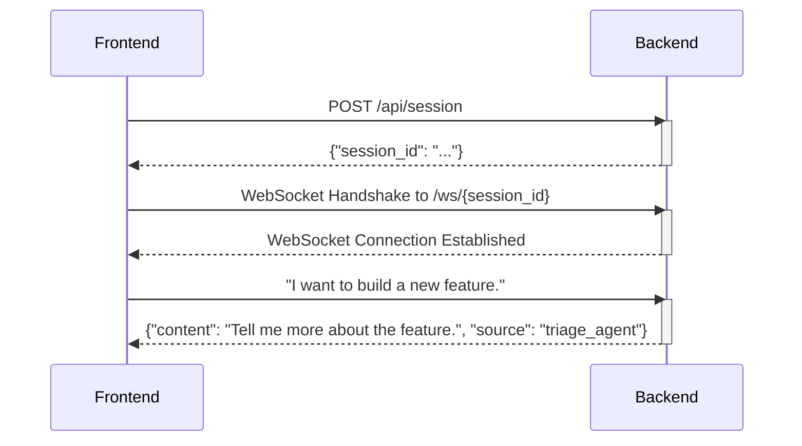

# Communication Protocol

This document outlines the communication protocol between the frontend and the backend of the application. The communication is established through a combination of a REST API for session management and a WebSocket for real-time messaging.

## 1. Session Initialization

The communication begins with the frontend requesting a session ID from the backend via a REST endpoint.

### Request

- **Method:** `POST`
- **Endpoint:** `/api/session`
- **Body:** None

### Response

- **Status Code:** `200 OK`
- **Body:**

```json
{
  "session_id": "a-unique-session-id"
}
```

## 2. WebSocket Connection

Once the frontend receives the `session_id`, it establishes a WebSocket connection to the backend.

- **URL:** `ws://<host>:<port>/ws/<session_id>`

## 3. Messaging

All subsequent communication occurs over the established WebSocket connection.

### Frontend to Backend

The frontend sends user messages as a raw string.

- **Format:** Raw string
- **Example:** `"I want to build a new feature."`

### Backend to Frontend

The backend sends messages from different agents as a JSON object. This object represents a serialized `LLMMessage` from the `autogen_core` library.

- **Format:** JSON string
- **Example:**

```json
{
  "content": "Hello! How can I help you with your project today?",
  "source": "triage_agent"
}
```

The `source` field indicates which agent sent the message. This is used by the frontend to display the message with the correct avatar and color.

## Full Messaging Example (Sequence Diagram)

The following diagram illustrates the complete message flow, from session creation to a user sending a message and receiving a response.


